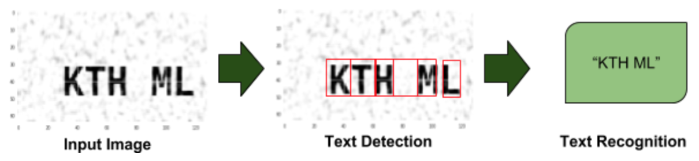
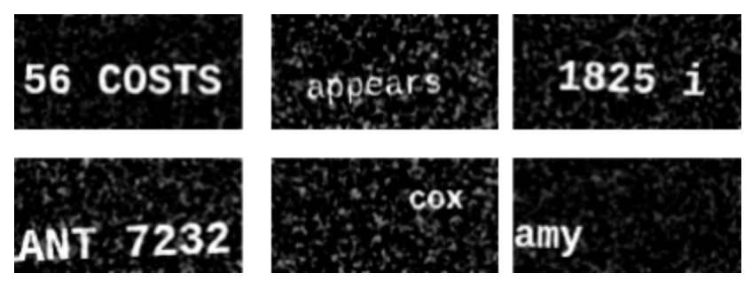
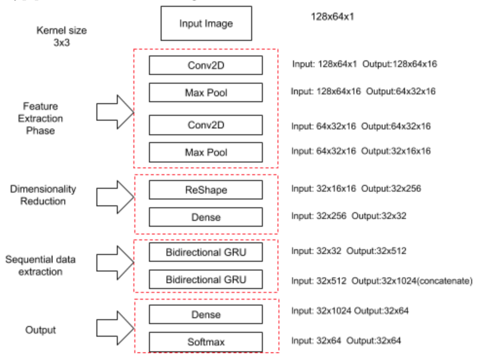
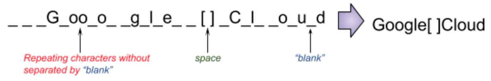
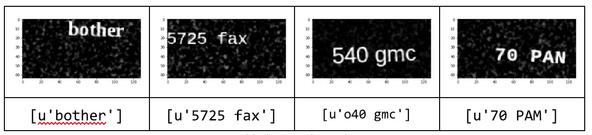

# CSR: Character Sequence Recognition from Images
#### OCR using Deeplearning

### Introduction
Recognition of texts from images and videos having numerous applications in different domains like banking, legal, healthcare, safety etc[1]. This technique commonly known as Optical Character Recognition[2] or OCR. Through this project we implement detection and recognition of the character sequences from images.

### Method
An overview of implemented method is illustrated in the figure below.

 

Steps involved in realizing this project are:
<ul>
<li>Create dataset</li>
<li>Train the model</li>
<li>Testing</li>
</ul>

### Create dataset
We used monogram word list in the dataset provided by Mythic AI[3] to create the images. Images are generated using cairocffi library[4] by taking monogram words and randomly capitalize them and append numbers in before and after the each word. Also, choose random font size, location and rotation. Samples of generated images are given below

 
</img>

### Train the model
We use architecture followed in the OCR example provided in the Official Keras GitHub repository[5]. The model structure is given below.

 
</img>

The output from network having size (32x64). Here the 32 represents the number of timesteps and 64 represents the possible characters(26 small letters, 26 capital letters, 10 digits, space and blank).
Since the text could be anywhere in the space, to locate each character in the image we use Connectionist Temporal Classification(CTC)[6]. We have 32 timesteps. But the word may not have that much length. CTC using blank token to separate the characters. It helps to merge repeating characters without separated by blank[7].

In the decoding phase, following actions take place.
- Collapse repeating characters without separated by blank. So, as in given below, two ‘o’s will get merged as they are not separated by blank.
- Then remove blank tokens.

 
</img>

### Testing
Some sample images and detected characters are given below.

 
</img>

### To Run
- First run <code>ocr_data_gen.ipynb</code> to generate dataset.
- Split the dataset to train set and test set.
- Create model using <code>ocr_main.ipynb</code> and test the model using <code>ocr_result.ipynb</code>.

### References
[1] Singh, Amarjot, Ketan Bacchuwar, and Akshay Bhasin. "A survey of OCR applications." International Journal of Machine Learning and Computing 2.3 (2012): 314.

[2] Mori, Shunji, Hirobumi Nishida, and Hiromitsu Yamada. Optical character recognition. John Wiley & Sons, Inc., 1999.

[3] Mythic-ai.com. (2019). Index of /datasets. [online] Available at: http://www.mythic-ai.com/datasets/ [Accessed 26 Jan. 2019].

[4] Cairocffi.readthedocs.io. (2019). cairocffi — cairocffi 0.9.0 documentation. [online] Available at: https://cairocffi.readthedocs.io/en/stable/ [Accessed 26 Jan. 2019].

[5] GitHub. (2019). keras-team/keras. [online] Available at: https://github.com/keras-team/keras/tree/master/examples [Accessed 26 Jan. 2019].

[6] En.wikipedia.org. (2019). Connectionist temporal classification. [online] Available at: https://en.wikipedia.org/wiki/Connectionist_temporal_classification [Accessed 26 Jan. 2019].

[7] Zhang, C. (2019). Keras model to recognize text with variable length. [online] www.dlology.com. Available at: https://goo.gl/zpe13s [Accessed 26 Jan. 2019].
